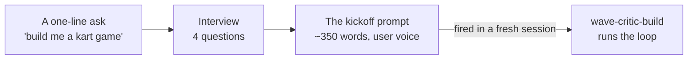

# Writing the kickoff prompt

The kickoff prompt is the highest-leverage artifact in a large agent build. It is
written once, fired once, and everything that follows — the decomposition, the
critics, the standard, whether it ever terminates — is downstream of what it said.

This skill's job is to get it right by **asking first**.

**You are writing a prompt, not building the thing.** Emit the prompt, hand it
over, stop. The build starts when the user fires it — usually in a fresh session
at the repo root.

---

## The rule

> **Never write the prompt from the one-line ask alone.**

A one-line ask is missing the single thing that decides whether the loop works: a
**named, shipped product to be judged against**. Without it every critic returns
"looks good, 8/10" and the build plateaus at competent. With it, a critic can
write the reference down from memory and run a blind A/B.

Everything else in the interview is a convenience. This one is load-bearing.

---

## Step 1 — The interview

Ask these four with `AskUserQuestion`, in one call. Tailor the options to the
domain in their ask — the ones below are the shape, not the literal text.

### Q1. The benchmark — *"What existing product is the bar?"*

The most important question you will ask. Offer 3 named, shipped products
plausible for their domain; make the recommended one the first option and append
"(Recommended)" to its label.

Games → *Mario Kart 8 Deluxe*, *Celeste*, *Hades*. Web apps → *Linear*,
*Stripe Checkout*, *Superhuman*. Services → *Stripe's API*, *Twilio's API*.
Pipelines → a published schema or convention.

**If they answer with an adjective** — "AAA quality", "really polished",
"professional" — do not accept it and move on. Ask again, once, plainly: *which
shipped product should a critic compare this against, side by side?* An adjective
gives the critic nothing to recall. If they genuinely cannot name one, say what
that costs — the loop still runs, but the blind A/B is gone and scores drift up —
and write the prompt with the closest named thing you can find.

### Q2. How it runs — *"Supervised or unattended?"*

| Answer | What changes in the prompt |
|---|---|
| One wave, then I review | No orchestrator loop; ends after a wave and reports |
| Supervised — I'm around today | `/loop`, waves land while they watch |
| Unattended — overnight / for days | Adds the hourly orchestrator loop, the ledger, and the messaging rule |

### Q3. Termination — *"How does this end?"*

Ask this even though it feels premature. It is the one thing the original prompt
this skill is modelled on got wrong: *"no fixed number of rounds, don't stop until
each critic is utterly wowed"* does not terminate against a shipped benchmark. In
the recorded run it produced six days and ~90 builder/critic pairs with **0 passes
out of 17 pieces**, scores climbing steadily the whole time. The loop was working
perfectly. It simply had no finish line.

Offer, recommended first:

- **Plateau rule** — keep going, but a piece whose score moves < 0.5 across two rounds gets escalated with the gap named, not another round.
- **Round budget** — each piece gets at most N rounds, then ships at its score with the gap recorded.
- **Time budget** — run until a wall-clock time, then land what exists and report the board.
- **Wowed or nothing** — the original. Say plainly that this one does not terminate on its own.

### Q4. Stack and surface — *"What is it built in, and where does it run?"*

This decides the harness, which is the thing that makes any of it observable.
Browser/Three.js, a web app, a CLI, a service, a pipeline. If they have no
preference, pick the one with the best headless capture story and say so.

### A second round, only if needed

Ask a follow-up round **only** when something material is still open:

- The ask is vague about *what the thing actually is* — get the concrete nouns.
- **There is existing code** — is this a new build or a rescue? A rescue prompt
  must say what must not be touched.
- Anything **out of scope or off-limits** they already know about.

Two rounds is the ceiling. This is a prompt generator, not a requirements
workshop; a long interview defeats the point of the skill.

---

## Step 2 — Write the prompt

Copy `assets/superprompt.template.md` and fill it. Full clause-by-clause
reasoning is in `references/anatomy.md`; worked examples, including the original
that this is derived from, are in `references/examples.md`.

Write it **in the user's voice** — first person, imperative, addressed to Claude.
It is going to be pasted as a user turn, and it reads wrong in any other voice.

The clauses that carry the weight, in rough order:

| Clause | What it buys | Drop it and |
|---|---|---|
| *at the level of `<named product>`* | The benchmark | Everything scores 8/10 |
| *break it into the smallest pieces that can be judged on their own — **you** decide, not me* | Delegated decomposition | User-named "pieces" are usually seams no one can own |
| *a separate sub-agent with fresh context* | The critic role | The builder marks its own work |
| *check the actual rendered result — **never the builder's summary*** | Observation over report | The most persuasive artifact in the system is also the least reliable |
| *a really harsh critic* | Calibration | Uniform 8/10 and a compliment |
| *compare side by side **blind** and say which is better* | The honest signal | Praise that survives contact with nothing |
| *name the **single** biggest gap and send the builder back* | One gap, with a directive | Twelve findings → the three easy ones get fixed |
| *between major waves, one fresh agent smooths it into one coherent thing* | The coherence pass | Good parts, incoherent whole |
| *keep a live progress page* | The ledger | Nobody, including the user, can see the state |
| *fan out sub-agents / `/loop` / ultracode* | The triggers | It politely does it one at a time in one context |

Two things to **add** that the original did not have:

**A Phase 0 clause.** Tell it to stand up the harness, the capture command and the
progress page *before spawning a single builder*. Retrofitting any of them costs a
wave of work that gets redone.

**The termination clause from Q3**, stated explicitly. See the template for the
four variants.

---

## Step 3 — Hand it over

Write it to a file in the target repo — `tools/kickoff.prompt.md` is a good home,
next to where the tick prompt will live — and also print it in full in your reply,
because they will want to read it before firing it.

Then tell them how to fire it, in one line:

> Start a fresh session at the repo root and paste it. The prompt's last line
> already says `ultracode`, so multi-agent orchestration is opted in from the
> first turn — and "fan out sub-agents" in your own words is itself an opt-in,
> so it still works if you strip the keyword.

A fresh session matters: the kickoff prompt is written to be read cold, and a
session already full of the conversation that produced it will anchor to that
instead. The prompt does not depend on `wave-critic-build` being installed in
the target session — it encodes the whole loop in natural language (that is
what `references/anatomy.md` documents) — though having the skill there hands
the fired session its templates instead of making it derive them.

**Do not fire it yourself** unless they ask you to. This skill ends with the
prompt in their hands.

---

## Files in this skill

| File | Read it when |
|---|---|
| `assets/superprompt.template.md` | Writing the prompt. The fill-in template and the four termination variants |
| `references/anatomy.md` | You want to know why a clause is there before cutting it |
| `references/examples.md` | You want a full worked prompt — the original, plus other domains |

**Companion skill:** `wave-critic-build` is what runs once the prompt is fired —
the harness, the critic protocol, the coherence pass, the orchestrator loop and
the termination policy. Read it if the user asks how any of this actually works,
or if they want the loop run rather than the prompt written.
