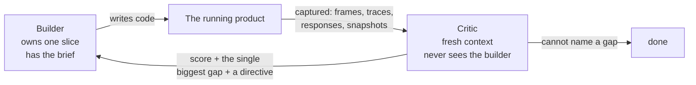
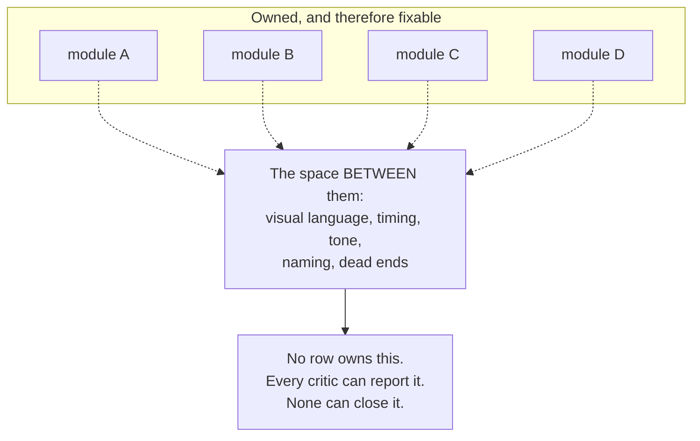

# The wave/critic build loop

A repeatable way to build a large artifact with many agents, where **no human
reviews any individual change** and quality still goes up.

The whole thing rests on one sentence:

> An agent cannot improve what it cannot observe, and it will not be honest about
> what it built. So make the product **observable by machine**, and hand the
> observation to **a different agent that never saw the build**.

Everything below is scaffolding around that.



This is not "generate, then review the diff". Code review cannot catch *the drift
sparks don't change colour at tier 2*, or *the empty state is unreachable*. The
reviewer has to run the thing, put it in a specific state, and look at the result.

---

## When to reach for this, and when not to

Worth the setup cost when the work is **large, quality-sensitive, and
decomposable** — dozens of hours of agent time, a bar higher than "it works", and
natural seams to split along. The setup is roughly a day; it pays back over days
or weeks of unattended building.

Not worth it for a single feature, a bug fix, or anything where a person is going
to read every diff anyway. Use ordinary review for those.

**If the user has not started yet** and wants the opening prompt written rather
than the loop run, that is the `build-kickoff` skill — it interviews them (above
all: which shipped product is the benchmark) and emits the kickoff prompt that
starts everything below.

---

## Phase 0 — The five preconditions

**Do not spawn a single builder until all five exist.** Every one of them tends to
get retrofitted, and every retrofit costs a wave of work that has to be redone.

Read `references/preconditions.md` for the detail. In brief:

| # | Precondition | The test of whether you have it |
|---|---|---|
| 1 | **A machine-drivable harness** | An agent can put the product in any state and dump ground truth about it, deterministically, without waiting in real time |
| 2 | **A review sheet** | One command captures every state worth looking at, by name |
| 3 | **A contract, encoded as types** | A cross-module break fails the typecheck, not a code review |
| 4 | **A *named* external benchmark** | A critic can write down what that specific shipped product does, from memory |
| 5 | **A ledger** | One row per piece: state, score, and the critic's verbatim gap |

Two of these are worth expanding here because they are the ones people
under-build.

**The harness must be deterministic and time-simulated.** Seeded randomness,
frozen clock, deterministic ids, and a way to advance the model without waiting
for wall-clock. That is what makes a screenshot reproducible and turns a bug
report into a *seed plus a timestamp* instead of an anecdote. See
`references/harness-recipes.md` for game, web app, service and pipeline shapes.

**The benchmark must be a named product, not an adjective.** "High quality" gives
you nothing to compare against. "Mario Kart 8 Deluxe", "Linear's issue view",
"Stripe Checkout", "Superhuman's command palette" all give the critic something
concrete to recall and a blind A/B to run. If the user has not named one, **stop
and ask before anything else** — offer three plausible shipped products, the way
`build-kickoff`'s Q1 does. And prefer one the model demonstrably knows: the
critic writes its reference *from memory*, so an obscure or post-cutoff product
gets a hallucinated reference and the gate scores real captures against fiction
(the recall check and the reference-corpus fallback are in
`references/preconditions.md`).

And one rule that is easy to skip and expensive to skip:

> **A harness hides the class of bug that lives in the layer it replaces.**

If `setInput()` writes a virtual input, it bypasses the device path — and a
mirrored key mapping can survive for weeks while every automated check passes. So
at least one instrument must drive the product the way a real user does: real key
events, real HTTP, real clicks. Everything else can use the fast path.

---

## Phase 1 — Decompose into pieces

A **piece** is the unit of building and judging. Write them into a manifest —
copy `assets/pieces.example.json`.

Three rules decide whether your decomposition will work:

1. **Ownership globs must be disjoint.** Overlap is the one failure mode parallel
   agents cannot recover from. Each piece owns files nobody else may touch.
2. **A piece must be judgeable alone,** from the review sheet, by someone who has
   never seen the code. If you cannot name the captured states that show it, it is
   not a piece — it is a *seam*, and it belongs to the coherence pass (Phase 3).
3. **Briefs state what exists today and what is missing, concretely.** Name a
   measurement, a file, or an observable defect. Vague briefs produce vague work.

A brief that works reads like: *"Own the item system. It does not exist yet —
without it this is a time trial, not a kart racer. Physics already reads
`racer.coins`; nothing ever increments it."* A brief that does not: *"Improve the
item system."*

---

## Phase 2 — The wave

Copy `assets/wave.workflow.template.mjs`. It is domain-independent — it reads the
manifest and needs no editing, which matters because a script you edit every wave
is a script whose resume cache never hits.

```js
Workflow({ scriptPath: "<repo>/tools/wave.workflow.mjs",
           args: { manifest: "<repo>/tools/pieces.json",
                   pieces: ["list", "detail"], rounds: 2, carry: {} } })
```

Structural choices worth preserving if you write your own:

- **Pipeline, not parallel.** Piece A may be in round 3 while piece B is in round
  1. A barrier between build and judge wastes the fast piece's wall clock.
- **Concurrency is bounded by cores, not ambition.** Each capture run is a
  headless browser. Three of them on four cores starve each other into false
  negatives — and a critic reasoning from contended frames produces confident
  nonsense. The bound is enforced by wave size: with one self-contained chain
  per piece, pieces in flight *is* the concurrency, and the harness's own cap
  is sized for CPU threads, not for what a headless browser weighs.
- **Short waves.** Two pieces, two rounds. Long waves lose more to a crash than
  they gain in throughput.

### The critic protocol

This is the part that makes the whole thing work, and it is mostly about denying
the critic the chance to be generous. Four steps, and the **order is the trick**:

1. **Write the benchmark down from memory — before opening our product at all.**
2. Drive the real product through the harness and read the captured output.
3. **Blind A/B**: two unlabelled descriptions of the same moment; pick one.
4. Verdict: a score, **the single biggest gap**, and an actionable directive.

Step 1 exists because of a specific failure mode: an agent that looks at your
product first will unconsciously anchor to it, then recall a version of the
benchmark that conveniently resembles what it just saw. Writing the reference down
*first* makes that impossible.

The verdict is structured output, so a malformed one is retried rather than
regex-parsed:

```js
{ score, pass, reference, blindPick: 'ours'|'benchmark'|'tie',
  biggestGap, directive, evidence: string[] }
```

Gate on **three independent signals agreeing**:
`pass && score >= PASS_SCORE && blindPick !== 'benchmark'`. A critic that scores 9
while still picking the benchmark has contradicted itself, and the gate catches it.

`biggestGap` is singular on purpose. A list of twelve findings gets you a builder
that fixes the three easy ones; one gap gets it closed.

`evidence` must be **observations, not code readings** — that is what turns a
verdict into the next round's acceptance test:

> ~~"The item system feels sparse."~~
>
> "The player's item slot is empty for **87% of a race** — 3 draws in 145 seconds,
> one unbroken 63.7-second stretch with nothing."

The second one *is* a test. The builder has to run the thing to know whether it
passed, rather than eyeballing a screenshot.

Critics also need explicit **calibration** or they all return 8/10 and a
compliment: *"Be genuinely harsh. 7 is a normal score for competent work. Our
product is new; the default expectation is that the benchmark wins."*

Full prompt text, schema and calibration language: `references/critic-protocol.md`.

### Carry

A wave that ends without a pass has still produced its most valuable output — a
measured directive — and that must survive into the next run. Pass prior verdicts
in as `carry`, and open the builder prompt with them:

```
── ROUND 3. A critic used the previous build and rejected it. ──
Score 6.5/10. Blind A/B: benchmark.
Biggest gap:  <one sentence>
Directive:    <what to change>
Observed:     <the measurements>
Close that gap first. Do not start a redesign.
```

That last line matters: without it, round 3 opens with a rewrite of round 2.

**When a gap closes, ratchet it.** The measurement in the verdict — *"item slot
empty for 87% of a race"* — becomes a deterministic test inside the builder's
ownership, wired into the test gate. A closed gap without a ratchet test can
silently reopen in any later round, and only a critic happening to re-judge
that piece would ever notice; with the test, the suite grows exactly as the
build matures and every verdict the loop paid for stays paid for. Critics still
judge the product, never the tests — the ratchet is the builder's guard-rail,
not the judgment.

**Never re-buy an earned verdict.** When a run dies, read its journal for results
that already carry a score and carry those forward.

---

## Phase 3 — The coherence pass

This is the part most people skip, and it decides whether you get a product or a
pile.

Strict ownership is what lets many agents edit one repo at once. It has a cost
that **nothing inside it can pay**: no row in the ownership table owns the space
*between* the rows.



The signature symptom: **the same defect is reported by several critics and closed
by none.** In the worked example, five separate critics failed five different
pieces on missing contact shadows. Each diagnosed it correctly inside its own
module. None could fix it, because the shadow camera belonged to one module and
the cast flags lived in four others.

So `assets/coherence.workflow.template.mjs` runs **survey → smooth → judge**, with
one agent that owns the whole repo and no restrictions, judged by a critic scoring
the product as a single work.

**It must never overlap a wave.** Whole-repo ownership and strict ownership cannot
both be true at once, and the builder loses that race silently.

The survey hunts eight kinds of seam — `visual`, `timing`, `tone`, `feedback`,
`language`, `input`, `continuity`, and **`dead-end`**.

> **`dead-end` matters most. Ninety percent of parallel-agent work fails here:**
> the piece exists, is good, and nothing in the running product ever calls it.

Handlers with no emitter, emitters with no listener, routes with no link, flags
with no reader, branches nothing can trigger. In the worked example the first
survey found eleven events emitted every race into a room with no listeners —
which is why the wrong-way alarm had no alarm.

The smoother gets two licences builders never get, plus one structural rule:

- **Where two pieces disagree, don't split the difference.** Pick the better one,
  make the other match it, say which you picked and why.
- **You may delete.** A system built but unreachable is worse than no system: it
  costs runtime, it costs the next agent's reading time, and it makes the repo lie
  about what the product is.
- **Promote shared values into one owner.** *A seam you close by hand reopens next
  wave.* A number two modules must agree on is not a tuning constant, it is an
  interface — and a shared constant with a second copy downstream of it is not
  shared, it is decorated.

Detail and full prompts: `references/coherence-pass.md`.

---

## Phase 4 — The orchestrator loop

A persistent session woken on a schedule (hourly works well), running a
**procedure, not a request**. Copy `assets/orchestrator.prompt.md`; follow
`references/orchestrator-setup.md` to stand it up; read
`assets/orchestrator.example.md` to see a populated one.

**How it wakes depends on where it runs.** On a local machine that never
sleeps, `/loop` or an in-session cron is fine — the session lives as long as
the machine does. In a remote environment the container suspends without
warning, so the scheduler must live outside the thing it schedules: a
server-side Routine (`create_trigger`). An in-session cron or `/loop` dies
with the container — in exactly the event it exists to detect — and a
`send_later` re-arm chain, whose pending reminder does survive suspends, has a
single point of failure per tick: one failed re-arm and nothing ever fires
again. The recorded run's killer was the fallback move — replacing a loudly
failed re-arm with an in-memory cron whose own tool result said
"session-only" — and it cost 67.5 hours of silence, caught by the human, not
the loop.

```
STEP 0 — publish the session archive
STEP 1 — PROVE the wave is alive
STEP 2 — if DEAD: RESUME, do not relaunch
STEP 3 — if ALIVE: run the gates, commit, push, do nothing else
STEP 4 — if FINISHED: verify → look → update the ledger → merge → launch the next
```

Setting it up is mostly one decision, and it explains the odd shape of a real tick
prompt:

> **The tick prompt is the loop's only memory.**

Waves die, sessions get replaced, the container restarts. The repo and the prompt
are what survive. So write it to be correct when fired into **a session that has
never seen the project** — which means the current run, the queue, the standing
gaps and any parked decisions all live inline, and anything derived from a session
id (the workflow run directory included) is *resolved each tick*, never pinned.
Put it in the repo as `tools/tick.prompt.md` and let the loop amend it; a prompt
pasted into a scheduler is frozen, a prompt in the repo learns.

Three things carry most of the value:

**Liveness is not "files exist".** Sub-agents often run *in-process*, so a process
listing shows nothing for a perfectly healthy wave; and files, browsers and
temp dirs all outlive the agents that made them. The decisive check is the **age of
the main agent process**: if it has been alive for less time than the gap since
the last agent write, the container restarted and everything in flight is dead —
however recent the file timestamps look. Judging this wrong is what produces
multi-hour silent stalls.

**Resume, never relaunch.** Completed agent calls replay from cache; only the
killed ones re-run, carry intact. The cache is keyed on each agent call's
prompt, so re-pass the **exact args value verbatim** into an unedited script —
that is what keeps every completed call's prompt identical. Resume is
**same-session only**: a replaced session skips straight to journal-rescue and
relaunches fresh with the earned verdicts as carry.

**Verify before walking away.** After any launch or resume, grep the new agent
transcripts for the piece name and the carried observations. A silent arg-parsing
bug can drop two of three pieces while the wave cheerfully reports itself started
— so anything that can mis-route a wave should **throw rather than default**.

### Gates, ordered by strength

| Gate | Strength | What it actually proves |
|---|---|---|
| Typecheck / lint | Weak | The modules still agree about their interfaces |
| Unit + ratchet tests | Medium | The pieces' logic invariants hold, and no gap a critic ever closed has reopened |
| Smoke run | **Real** | It still boots and runs |
| Look at the captured output | **Truth** | It is what you think it is |

State the order explicitly in every prompt, because agents reliably stop at the
cheapest green light. **A typecheck has passed on a build that did not boot.**

### Two things a green board will not tell you

Keep both as standing sections of the tick prompt.

**Unjudged surfaces.** The gates only drive the surface *the harness drives* — so
the mobile build, the screen-reader path, the cold start and the error states can
pass everything for weeks without a critic ever opening them. Name them, and give
each its own round, with its own brief and benchmark, once the board is otherwise
green.

**Parked work.** When the user parks something, write it into the prompt in a
block of its own: the decision **with their own words quoted**, the scope stated
as negatives (not triggered by the board going green, not part of done, not to be
raised again — and the build *can* finish without it), and the analysis already
done, explicitly **labelled reference, not instructions**. Skip the block and the
loop either starts it, raises it every tick, or re-derives the work from scratch
when the user finally asks.

---

## Phase 5 — Termination

**Decide this before you start.** The loop as usually specified — "keep going until
a critic is wowed" — does not terminate against a shipped benchmark. It is an
asymptote, not a finish line. In the worked example, six days and ~90 builder/critic
pairs produced 0 passes out of 17 pieces, with scores rising steadily from 5.5
toward 7.5 the whole time. That is the loop working, and it is also a project with
no end date.

A workable policy:

```
A piece is DONE when any of:
  (a) the critic cannot name a gap                       → pass
  (b) score plateaus: Δ < 0.5 across two rounds          → escalate, don't re-run
  (c) the gap names something outside the piece's scope  → new piece, or coherence
  (d) the round budget for this piece is spent           → ship at score, record the gap
```

Also watch for the **absence-vs-defect** signal: when critics start failing a piece
for something its vocabulary *cannot express* — "the courses have no hazards,
because nothing in the track vocabulary can touch a player" — more rounds cannot
help. That is a scope decision, not an iteration.

Record the gap in the ledger either way. An honest board that says *7.0, and here
is exactly what is wrong* is far more useful than one that says *passed*.

More: `references/termination.md`.

---

## The failure catalogue

Read `references/failure-modes.md` before your first long run. The ones that cost
the most:

| Symptom | Cause | Fix |
|---|---|---|
| The loop stops ticking for days | Scheduler lived in-session: in-memory cron, or a re-arm chain with one failed link | A server-side Routine; the scheduler must outlive the container |
| "Still running" reported over a corpse | Status question answered from inference | Any "is it running?" runs the liveness procedure first |
| Silent multi-hour stall | Liveness judged by files or process greps | Judge by main-process age |
| A wave rebuilds finished work | Args arrived as a string; script fell through to defaults | Throw on unparseable args |
| One piece of three gets built | A carry field threw inside a pipeline stage, dropping the item to null | Normalise carry; grep transcripts after launch |
| Everything scores 8/10 | No calibration in the critic prompt | State that 7 is normal and the benchmark wins by default |
| Good parts, incoherent whole | No coherence pass | Run one after any wave that merges two or more pieces |
| A defect reported by five critics, fixed by none | It lives between owners | Coherence pass owns it |
| Confident nonsense in a verdict | Captures taken while other agents contended for cores | Never capture during a wave on a contended harness (browsers, GPU) |
| Two waves running at once | `WFDIR` pinned; it embeds a session id and went stale when a fresh session took over the loop | Resolve it by glob every tick |
| A whole surface reaches "done" unjudged | The gates only drive the surface the harness drives | Keep a standing list of unjudged surfaces |
| Parked work gets started anyway | No parked block, or its notes read as a checklist | Quote the user; label notes "reference, not instructions" |
| The loop never ends | No termination policy | Phase 5 |

---

## Adapting beyond software UI

Only the five preconditions change; the loop, roles, schema, coherence pass and
orchestrator are domain-independent.

| Precondition | Game | Web app | Service / API | Data pipeline |
|---|---|---|---|---|
| Harness | fixed-timestep sim + global | seeded fixtures, frozen clock, `goto(state)`, `flush()` | test client + seeded DB + deterministic ids | fixed input corpus + every intermediate |
| Review sheet | named frames | screens × {empty, loading, error, dense, mobile, dark} | named request scenarios incl. all the unhappy ones | input slices → snapshots, counts, null profile |
| Benchmark | a shipped game | a shipped app | a published API with a real error taxonomy | a published schema / convention |

Things to add outside games: **security and accessibility as standing critic
lenses** with their own benchmark; **copy as its own piece with its own owner**, or
eight agents write in eight voices and every coherence round is spent on tone.

---

## Files in this skill

| File | Read it when |
|---|---|
| `references/preconditions.md` | Setting up. Phase 0 in full |
| `references/harness-recipes.md` | Designing the harness for your project type |
| `references/critic-protocol.md` | Writing the critic prompt, schema, calibration |
| `references/coherence-pass.md` | Running the between-waves pass |
| `references/orchestrator.md` | How the scheduled loop works; debugging a stall |
| `references/orchestrator-setup.md` | Standing the loop up: WFDIR, scheduling, the bootstrap tick, parking work |
| `references/termination.md` | Deciding when it's done; a piece has plateaued |
| `references/failure-modes.md` | Before the first long run, and whenever something is odd |
| `references/worked-example.md` | You want the receipts: a real 6-day run, with numbers |
| `assets/pieces.example.json` | Writing your manifest — usually the only file you author |
| `assets/CONTRACT.template.md` | Writing the ownership contract |
| `assets/wave.workflow.template.mjs` | Copy to `tools/`. No editing needed |
| `assets/coherence.workflow.template.mjs` | Copy to `tools/`. No editing needed |
| `assets/orchestrator.prompt.md` | Writing the scheduled tick prompt |
| `assets/orchestrator.example.md` | A live tick prompt on day four, every slot filled |

---

## The short version

1. Make it **observable by machine**, deterministically.
2. Name the states worth looking at; capture them on every run.
3. Give every piece **one owner and one disjoint file set**, in a contract encoded
   as types.
4. Judge with a **fresh agent that never sees the builder**, that writes the
   benchmark down *before* it looks, and returns **one gap** with a **measurement**.
5. **Carry the verdict forward.** Never re-buy it — and when a gap closes,
   **ratchet it**: the verdict's measurement becomes a deterministic test in the
   gates, so it can never silently reopen.
6. Run a **whole-repo pass, alone, between waves**, and let it delete things.
7. Keep waves short, prove liveness by process age, **resume rather than relaunch**.
8. Trust the smoke test over the typecheck, and the captured output over both.
9. Decide **how it ends** before you start.
