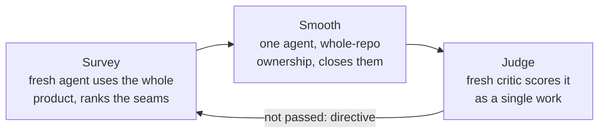

# The coherence pass

The counterweight to the build waves, and the part most people skip. It is what
decides whether you end up with a product or a pile.

---

## The structural argument

Strict file ownership is what lets many agents edit one repo at once without
trampling each other. It has a cost that **nothing inside it can pay**:

> No row in the ownership table owns the space *between* the rows.

Two agents each pick a defensible accent colour. Each passes its own critic. The
product ends up looking like it was made by people who never met — and no critic
in the system was ever asked whether it looks like one product.

### The symptom that tells you you need this

**The same defect is reported by several critics and closed by none.**

In the worked example, five separate critics failed five different pieces on
missing contact shadows — the menu stage, the world geometry, the machines, the
lowest quality rung, the carried items. Each diagnosed it correctly inside its own
module. None could fix it, because the sun's shadow camera belonged to the render
module while the cast flags lived wherever each mesh was built. Reported five
times, closed zero times.

If your ledger has a gap that keeps appearing in different pieces' verdicts, stop
sending it back to pieces. It is a seam.

---

## Survey → Smooth → Judge

Copy `assets/coherence.workflow.template.mjs`.

**It must never overlap a build wave.** Whole-repo ownership and strict ownership
cannot both be true at the same time, and the builder loses that race silently —
its files are edited under it and its round is wasted without any error.

---

## The eight seams

A seam is a discontinuity **between** pieces, not a flaw within one. Flaws within
one piece have their own critic; reporting them here wastes the pass.

| Kind | What it looks like |
|---|---|
| `visual` | Two modules picked different accents, radii, fonts, shadow language. A gradient in one panel and a flat fill in another. Anything that says "two authors" |
| `timing` | One transition holds 0.9s and another 0.4s; something snaps where everything else eases. Does the product have ONE rhythm? |
| `tone` | Is it the same voice in the navigation, the labels, the errors and the empty states? One product, or three different jokes? |
| `feedback` | Does everything that changes state also acknowledge it, and vice versa? A state change with no feedback partner is a seam |
| `language` | Is the same thing called the same name in the UI, the docs, the API and the code? |
| `input` | Does a control mean the same thing in every state? Can you get stuck? |
| `continuity` | Does state survive the transitions? Does what you chose show up everywhere it should? |
| **`dead-end`** | **Built, good, and nothing in the running product ever calls it** |

### `dead-end` matters most

> **Ninety percent of parallel-agent work fails here.** The piece exists, it is
> good, and nothing in the running product ever reaches it.

Handlers with no emitter. Emitters with no listener. Routes with no link. Flags
with no reader. Config keys nothing reads. Error branches nothing can trigger.
Empty states no path arrives at.

Each of those passed its own critic, because its own critic was looking at the
piece rather than at whether anything called it.

Real finds from a first survey:

- **Eleven events emitted every race into a room with no listeners** — which is why
  the wrong-way alarm had no alarm.
- **Thirteen theme keys with zero property reads anywhere in the source.** They
  were prose in a data structure, not switches, so four "distinct" courses all
  rendered as the same brown desert.
- **Eight racers finishing 6.5 km of racing inside 0.811 seconds of each other**,
  so the mechanic the menus call "the real game" was something a player had never
  once seen happen.

None of those is visible from inside a module. All of them are obvious to someone
using the whole product for ninety seconds.

Make the survey hunt them explicitly, with a grep-shaped instruction:
*find things that were BUILT BUT NEVER CONNECTED*.

---

## What the smoother is allowed to do

The smoother gets licences no builder gets. State them explicitly or it will
behave like a builder and close seams the timid way.

**Do not split the difference.** Where two pieces disagree, pick the better one,
make the other match it, and say which you picked and why. Averaging two
defensible choices produces a third choice nobody defended.

**You may delete.** A system built but never reachable is worse than no system: it
costs runtime, it costs the next agent's reading time, and it makes the repo lie
about what the product is. Wire it up or take it out.

**Promote shared values into one owner.**

> A seam you close by hand reopens next wave.

If two modules must agree on a number, that number is not a tuning constant — it
is an interface, and it needs one owner and one definition. Watch for the
half-shared case, which is worse than not sharing at all: **a shared constant with
a second copy downstream of it is not shared, it is decorated.** In the worked
example a fix moved a value into a shared module and the constructor still had a
line that rebuilt the old literal one frame later, so the shared value was set and
then immediately overwritten.

The output of a good smoothing round is usually a short list of new shared
modules — a theme file, a timing table, a name registry — plus deletions. If the
round produced only local edits, the seams will be back next wave.

---

## Judging the whole

The judge is the critic protocol applied to the product rather than a piece, with
one changed instruction:

> Judge the WHOLE, not the pieces: a product of eight excellent parts that do not
> agree with each other loses to one of seven good parts that do.

And a step 1 that asks for *feel* rather than features:

> Write down from memory what it feels like to sit down with `<BENCHMARK>` for
> ninety seconds. Not the graphics — the FEEL of the whole thing. Its rhythm, its
> confidence, how it never once makes you wonder what to press. Write that first,
> because after you have looked at ours you will unconsciously grade on a curve.

A whole-product verdict is also the most quotable artifact the loop produces, and
the most useful thing to put in front of a human. The first one in the worked
example opened:

> A bag of very good parts, and the parts know it — several files carry comments
> apologising for the space they cannot reach across.

That sentence is worth more than the score attached to it.

---

## Cadence

Run one between every wave, once pieces have merged. Two rounds is usually right:
the first finds structural seams, the second checks the fixes and finds the seams
the fixes created.

If a survey reports zero seams, go straight to judgement rather than smoothing —
but be suspicious. Zero seams after a wave that merged three pieces usually means
the surveyor did not reach the whole product. Check that it actually visited every
state on the review sheet.
