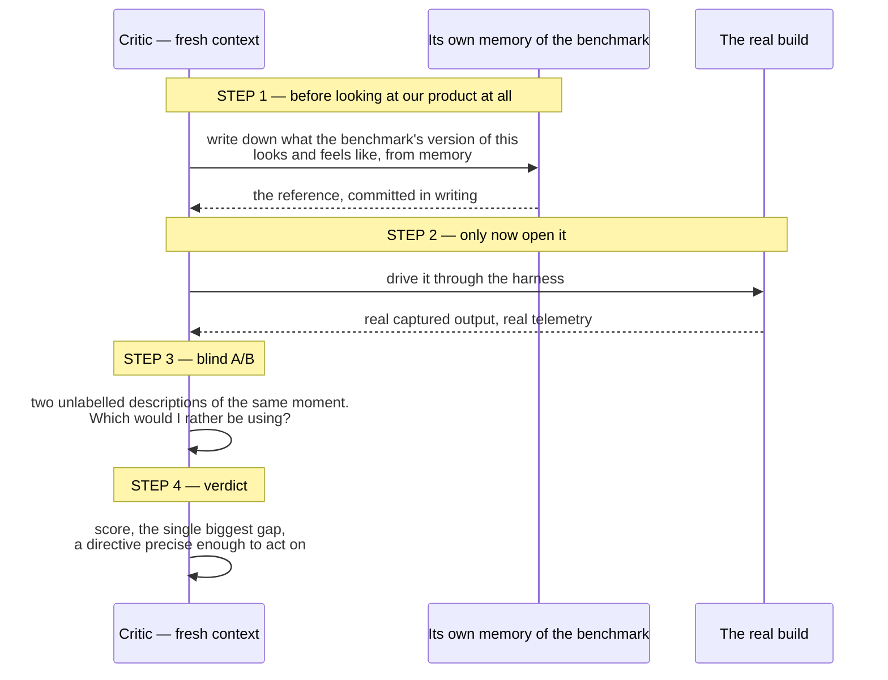

# The critic protocol

The critic is the mechanism. Everything else is scaffolding that lets a critic do
its job honestly.

Its whole design is about **denying the critic the chance to be generous** — to
itself, to the builder, or to the product.

---

## The four steps, and why the order is the trick



**Step 1 exists because of a specific failure mode.** An agent that looks at your
product first will unconsciously anchor to it, then recall a version of the
benchmark that conveniently resembles what it just saw — and score generously
against a reference it has quietly lowered. Writing the reference down *first*
makes that impossible.

**Step 3 forces a decision.** A score alone drifts upward over rounds; a forced
pick between two unlabelled descriptions does not. Requiring the descriptions to
be *unlabelled* is what stops the critic from grading the label.

---

## The prompt

```
You are a HARSH, INDEPENDENT CRITIC. You did not build this. Do not read the
builder's report or the commit messages. Judge only what the running product does.

── PIECE UNDER REVIEW: <name> (<owned files>) ── round <N>

STEP 1 — Write the reference from memory, BEFORE looking at our product at all.
From your knowledge of <BENCHMARK>, write down precisely what this piece looks
and behaves like there. Concrete and specific: exact cues, timings, what happens
step by step, what the user sees and feels. Name the exact moment you are using
as your reference. Do NOT look at our product yet.

STEP 2 — Use our product for real.
Capture the states "<shots>" into <dir> and READ every artifact with the Read
tool. Actually look. Then drive it over time to check behaviour, not just
appearance. Write your own capture script if the standard states do not show what
you need — the harness API is in the contract. Never judge from source alone.

STEP 3 — Blind A/B.
Write two unlabelled descriptions of the same moment: ours, and the <BENCHMARK>
reference from step 1. Pick which is better as a user would experience it. Our
product is new; the default expectation is that <BENCHMARK> wins. Only pick ours
if it genuinely deserves it.

STEP 4 — Verdict.
Score 0-10, where <PASS>+ means "I would believe this shipped as part of
<BENCHMARK>". Name the SINGLE biggest gap in one sentence. Then a specific,
actionable directive — not "make it better" but a named defect with a measurement
attached, precise enough that the builder can tell whether they fixed it without
asking you a question.

Be genuinely harsh. 7 is a normal score for competent work. If you can name a gap
a user would notice, it fails.
```

Four instructions in there are doing specific work:

- **"Do not read the builder's report or the commit messages."** The builder's
  summary is the most persuasive and least reliable artifact in the system.
- **"Never judge from source alone. READ the captured output."** Without this,
  critics reason about what the code probably produces — which is exactly the
  failure the whole loop exists to prevent.
- **"Write your own capture script."** A critic that can only see the standard
  sheet can only find standard problems.
- **The calibration numbers.** "7 is a normal score", "the benchmark wins by
  default", "only pick ours if it genuinely deserves it". Without these, every
  critic returns 8/10 and a compliment, and the loop stops producing information.

---

## The verdict schema

Structured output, validated at the tool-call layer, so a malformed verdict is
retried by the model rather than regex-parsed by you.

```js
{
  score:      number,   // 0-10
  pass:       boolean,  // true ONLY if you cannot name a gap that matters
  reference:  string,   // the specific benchmark behaviour judged against
  blindPick:  'ours' | 'benchmark' | 'tie',
  biggestGap: string,   // THE single biggest gap. One sentence.
  directive:  string,   // exactly what to change next
  evidence:   string[], // what was OBSERVED — measurements, not code readings
}
```

### Three design decisions that earn their keep

**1. `biggestGap` is singular.** A list of twelve findings gets you a builder that
fixes the three easy ones and reports success. One gap gets it closed.

**2. `pass` is separate from `score`.** Gate on three independent signals agreeing:

```js
const accepted = verdict.pass && verdict.score >= PASS_SCORE && verdict.blindPick !== 'benchmark';
```

A critic that hands out 9/10 while still picking the benchmark has contradicted
itself, and the gate catches it. This happens more than you would expect.

**3. `evidence` must be observations, not code readings.** This is what turns a
verdict into the next round's acceptance test. Compare:

> ~~"The item system feels sparse."~~
>
> "The player's item slot is empty for **87% of a race** — 3 draws in 145 seconds,
> one unbroken 63.7-second stretch with nothing."

The second one *is* a test. The builder has to run the thing to know whether it
passed, rather than eyeballing a screenshot and declaring victory.

More examples of the level to aim for, all real:

> The menu stage casts no contact shadow: ground luminance under the machine's
> tracks reads **96.9 against 42.4** for the asphalt beside it. The same machine
> on the race grid a quarter-second later is correctly 30% darker.

> The rocket start is inverted. Pressing accelerate *on* the green — a 0.1s
> reaction window — gives 1.38s of boost and 119.3 m in two seconds. Holding
> through the final beat, which is the actual rocket window, gives nothing and
> 41.5 m.

> The quality governor sat at its top rung for **331 seconds at roughly 4 fps**
> without a single change, because its warm-up gate is counted in rendered frames
> and the number it reads under-reports a GPU-bound frame by twentyfold.

Notice what all three have in common: a number, a comparison, and a mechanism. A
builder can act on any of them without asking a question — which is the actual
bar for `directive`.

---

## Carry

A wave that ends without a pass has still produced its most valuable output. It
must survive into the next run.

```js
const CARRY = input.carry || {};   // verdicts keyed by piece id
```

The builder prompt then opens with the prior verdict:

```
── ROUND 3. A critic used the previous build and rejected it. ──
Score 6.5/10. Blind A/B against <BENCHMARK>: benchmark.
Biggest gap:  <one sentence>
Directive:    <what to change>
Observed:     <the measurements>
Close that gap first. Do not start a redesign.
```

**"Do not start a redesign" is load-bearing.** Without it, round 3 opens with a
rewrite of round 2, the measurement is lost, and the score does not move.

**Never re-buy an earned verdict.** When a run dies, read its journal for results
that already carry a `score` and pass those forward. A verdict costs a full critic
agent; re-running one to rediscover what you already know is the most common way
these loops waste a day.

### One sharp edge

A verdict from the schema has `evidence` as an array. A verdict hand-authored as
`carry` arrives however the author typed it — often a string. `.join()` on a string
is a `TypeError`, and a `TypeError` inside a pipeline stage does not fail loudly:
it drops that item to `null` and skips its remaining stages. The wave launches,
reports itself started, and quietly builds one piece out of three.

Normalise defensively, and **grep the new agent transcripts after every launch** to
confirm the carry arrived.

---

## When to run more than one critic

Single-critic verdicts are enough for most pieces. Reach for more when a finding
would be expensive to act on wrongly:

- **Perspective-diverse verify** — when a piece can fail in more than one way, give
  each critic a distinct lens (correctness, performance, accessibility, "does it
  reproduce") rather than running the same critic three times. Diversity catches
  what redundancy cannot.
- **Adversarial refutation** — for a claim you are about to spend a wave on, spawn
  critics prompted to *refute* it and kill it if a majority succeed.
- **Standing lenses** — security and accessibility should be their own recurring
  critics with their own benchmark, not a line in someone else's brief. No feature
  owner applies those lenses to their own work.
